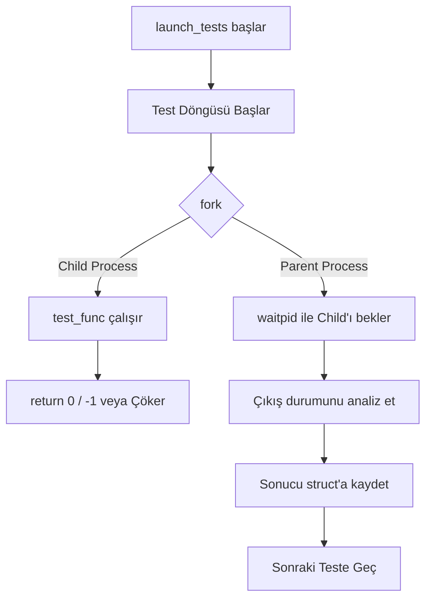
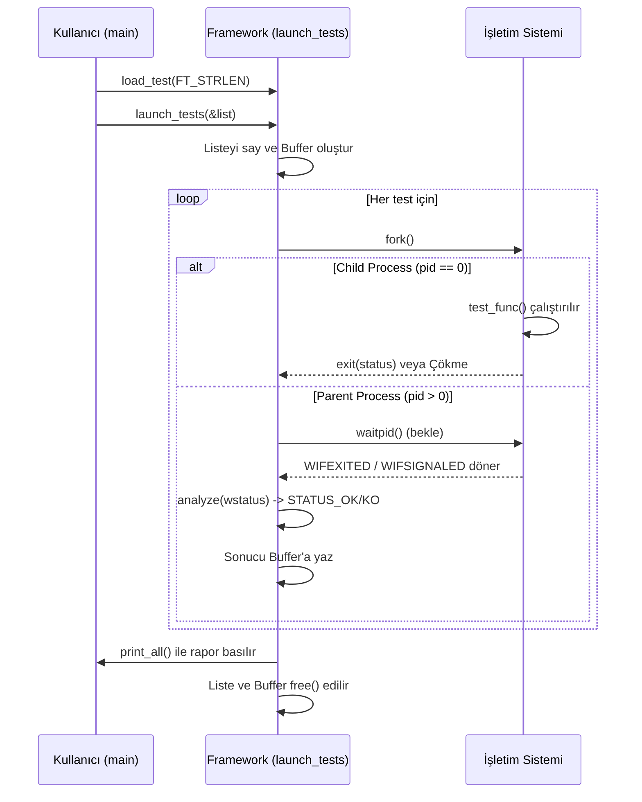

<div align="center">

# 🧪 LIBUNIT — *What the Fork?!*

**42 School | Rush Project | C Micro Unit Testing Framework**

[](https://42.fr)
[](https://en.wikipedia.org/wiki/C_(programming_language))
[](https://github.com/42School/norminette)
[](#-norminette-uyumu)
[](#-bonus-özellikleri)

> *"The difference between a good developer and an excellent developer lies in the impartiality of his/her test routines."*
> — Libunit Subject

</div>

---

## 📋 İçindekiler

- [Proje Tanıtımı](#-proje-tanıtımı)
- [Nasıl Çalışır?](#-nasıl-çalışır)
- [Kurulum ve Derleme](#-kurulum-ve-derleme)
- [Kullanım — Kendi Testini Yaz](#-kullanım--kendi-testini-yaz)
- [Framework Mimarisi](#-framework-mimarisi)
- [Test Yaşam Döngüsü](#-test-yaşam-döngüsü)
- [Sinyal ve Process İlişkisi](#-fork--exit--wait--signal-ilişkisi)
- [Çıktı Formatı ve Renkler](#-çıktı-formatı)
- [Bonus Özellikleri](#-bonus-özellikleri)
- [Klasör Yapısı](#-klasör-yapısı)
- [Norminette Uyumu](#-norminette-uyumu)
- [Kavramsal Arka Plan ve Structlar](#-kavramsal-arka-plan)

---

## 🎯 Proje Tanıtımı

**Libunit**, 42 School müfredatının **Rush** kategorisinde yer alan ve C dilinde sıfırdan minimal ama tamamen işlevsel bir **unit test mikro framework'ü** yazmayı hedefleyen projedir. Projenin tam adı *"What the Fork??"* dur; çünkü temel amacı UNIX process yönetimini (`fork` ve `wait`) test izolasyonu için kullanmayı öğretmektir.

C dilinde bir test framework'ü yazmanın en büyük zorluğu, hatalı bir testin (örneğin bir `Segmentation Fault`) tüm test sürecini çökertmesidir. Libunit, her bir testi kendi alt process'ine (child process) kopyalayarak çalıştırır. Böylece bir test patlasa bile ana program yaşamaya ve sonraki testleri çalıştırmaya devam eder.

> [!NOTE]
> Bu kütüphane dışarıdan **hiçbir bağımlılık** (Libft dahil) kullanmadan saf C ile yazılmıştır.

### ⚙️ Teknik Gereksinimler ve Kısıtlamalar

| Kural | Değer | Açıklama |
|-------|-------|----------|
| **Dil** | C | Tamamen düşük seviyeli standart C. |
| **Norm** | 42 Norminette | Kod standartlarına tam uyum. |
| **Global Değişken** | ❌ Yasak | Hiçbir veriyi global scope'ta tutamayız. |
| **Ternary Operatör** | ❌ Yasak | `condition ? a : b` kullanılamaz. |
| **İzin Verilenler** | `malloc`, `free`, `exit`, `fork`, `waitpid`, `write`, `alarm` | Başka hiçbir standard C kütüphanesi fonksiyonu yasak! (örn: `printf` yasak). |
| **Çıktı** | `libunit.a` | Kütüphane dosyası olarak derlenir. |
| **Satır Limiti** | Max 25 | Fonksiyon başına maksimum 25 satır. |
| **Fonksiyon Limiti**| Max 5 | Dosya başına maksimum 5 fonksiyon. |

---

## 🚀 Nasıl Çalışır?

Libunit tam olarak 3 adımda çalışır ve bu süreç linked list veri yapısı üzerinden işler:

### Adım 1: Test Kaydı — `load_test()`

Her test fonksiyonu, kendi adıyla birlikte dinamik olarak oluşturulan bir bağlı listeye (`t_unit_test`) eklenir.

```c
void load_test(t_unit_test **lst, char *func_name, char *name, int (*test)(void));
```

```text
testlist → [STRLEN | "Basic test" | &basic_test | next]
                                                     ↓
                                          [STRLEN | "NULL test" | &null_test | next]
                                                                                  ↓
                                                                                NULL
```

### Adım 2: Test Çalıştırma — `launch_tests()`

Listeye kaydedilmiş olan tüm testler sırasıyla `fork()` kullanılarak yürütülür:



### Adım 3: Raporlama — `print_all()`

Kayıt altına alınan test sonuçları ekrana standart formata göre basılır.

```text
FT_ATOI: Pozitif sayi [42] : [OK]
FT_ATOI: Negatif sayi [-42] : [OK]
FT_ATOI: Sadece bosluk [   ] : [KO]
17/17 tests checked
```

---

## 🛠️ Kurulum ve Derleme

### Ön Koşullar

- UNIX tabanlı bir işletim sistemi (macOS / Linux)
- GCC veya Clang derleyici
- Make

### Derleme Komutları

Proje `make` kullanılarak modüler şekilde derlenebilir:

```bash
# Temel kütüphaneyi (framework/mandatory) derler ve libunit.a oluşturur
make

# Framework'ü test eden kendi "dummy" (sahte) testlerini çalıştırır
make test

# Renkli çıktı ve timeout özellikli bonus sürümü derleyip testleri çalıştırır
make bonus

# Yazılmış örnek bir gerçek test senaryosunu (örn: ft_atoi) çalıştırır
make real LIBFT=../libft

# Derleme artıklarını (.o dosyalarını) temizler
make clean    

# Her şeyi (derlenmiş kütüphane dahil) siler
make fclean   

# Her şeyi temizler ve sıfırdan derler
make re       
```

> [!TIP]
> Testleri her zaman `make bonus` ile çalıştırmanızı öneririz. Bu sayede sonsuz döngülere karşı **timeout koruması** ve başarılı/başarısız durumlarını daha rahat görmenizi sağlayan **renkli konsol çıktıları** devreye girer.

### Beklenen Çıktılar

**`make test` Çıktısı (Mandatory)**
```text
DUMMY: OK test : [OK]
DUMMY: KO test : [KO]
DUMMY: SIGSEGV test : [SIGSEGV]
DUMMY: SIGBUS test : [SIGBUS]
1/4 tests checked
```
*(Not: Bu çıktı doğrudur. Kasıtlı olarak framework'ün sinyalleri yakalayıp yakalamadığını test etmek için hatalı senaryolar yazılmıştır.)*

---

## 💡 Kullanım — Kendi Testini Yaz

Kendi fonksiyonlarınızı test etmek, framework'e test yüklemek oldukça pratiktir:

### 1. Test Fonksiyonunu Yazın

Testler her zaman `int` dönmelidir. Başarı için `0`, başarısızlık için `-1` dönülmelidir. Eğer kodda `Segmentation Fault` alırsanız, kütüphane bunu otomatik tespit eder, özel bir dönüş yapmanıza gerek yoktur.

```c
/* Başarı: return (0) | Başarısızlık: return (-1) */
int   my_test(void)
{
    if (ft_strlen("hello") == 5)
        return (0);
    return (-1);
}
```

### 2. Launcher Fonksiyonu Yazın

Tüm testlerinizi bir listede toplamak için bir `launcher` oluşturun:

```c
#include "../../framework/mandatory/libunit.h"

int   my_test(void);

int   strlen_launcher(void)
{
    t_unit_test *testlist;

    testlist = NULL; // Listeyi sıfırla
    
    // Testleri listeye yükle
    load_test(&testlist, "FT_STRLEN", "Basic test", &my_test);
    
    // Testleri başlat
    return (launch_tests(&testlist));
}
```

### 3. Ana Programdan (main.c) Çağırın

```c
#include "../framework/mandatory/libunit.h"

int   strlen_launcher(void);

int   main(void)
{
    return (strlen_launcher());
}
```

### 4. Makefile Entegrasyonu

Testleri projenizin veya `real_tests/` içerisindeki `Makefile` dosyasına ekleyerek `make` veya `make real` ile derleyebilirsiniz.

---

## 🏛️ Framework Mimarisi

Sistemin iç yapısı ve dosya organizasyonu, sorumluluk prensiplerine göre izole edilmiştir:

```text
┌─────────────────────────────────────────────────────────────┐
│                       KULLANICI KODU                         │
│  main.c → launcher() → load_test() × N → launch_tests()     │
└──────────────────────────────┬──────────────────────────────┘
                               │
┌──────────────────────────────▼──────────────────────────────┐
│                     LIBUNIT FRAMEWORK                         │
│                                                               │
│  load_test.c          launch_tests.c      launch_utils.c      │
│  ┌─────────────┐     ┌─────────────────┐  ┌──────────────┐   │
│  │ load_test() │     │ launch_tests()  │  │ print_all()  │   │
│  │             │     │ count_tests()   │  │ ft_putstr()  │   │
│  │ malloc node │     │ buf_init()      │  │ ft_putnbr()  │   │
│  │ linked list │     │ run_all()       │  └──────────────┘   │
│  │ append tail │     │ free_list()     │                      │
│  └─────────────┘     └─────────────────┘                      │
│                                                               │
│  launch_utils_extra.c                                         │
│  ┌──────────────────────────────────────┐                     │
│  │ analyze()   → wait status → t_status │                     │
│  │ run_one()   → fork + waitpid         │                     │
│  └──────────────────────────────────────┘                     │
└──────────────────────────────┬──────────────────────────────┘
                               │
┌──────────────────────────────▼──────────────────────────────┐
│                        UNIX KERNEL                            │
│              fork()  waitpid()  exit()  signals               │
└─────────────────────────────────────────────────────────────┘
```

### Dosya Sorumluluk Tablosu

| Dosya | Modül Sorumluluğu |
|-------|-------------------|
| `load_test.c` | Test düğümü (node) oluşturma, bağlı liste yönetimi. |
| `launch_tests.c` | Ana test döngüsü, node'ların sayılması, bellekte yer ayırma ve liste temizliği. |
| `launch_utils_extra.c` | UNIX process yönetimi. `run_one()` ile fork işlemi, `analyze()` ile sinyal çözümlemesi. |
| `launch_utils.c` | Sonuçları tampon (buffer) üzerinden okuyup formatlı bir şekilde ekrana yazdırma. |
| `launch_tests_bonus.c` | Timeout özellikli ve ekstra güvenli test ana döngüsü (Bonus). |
| `launch_utils_extra_bonus.c`| Bonus sinyal analizi (`SIGABRT`, `SIGALRM`) ve timeout mekanizması. |
| `launch_utils_bonus.c` | ANSI escape sequence'ları ile konsol renklerini kontrol eden yazdırma fonksiyonları (Bonus). |

---

## 🔄 Test Yaşam Döngüsü

Bir testin Framework içerisindeki yolculuğu çok belirgindir. Bunu görselleştirmek gerekirse:



---

## 🔗 Fork / Exit / Wait / Signal İlişkisi

Libunit'in kalbi bu UNIX sistem çağrılarıdır. İşte her bir senaryonun perde arkası:

```text
PARENT PROCESS
     │
     │ fork()  ------> Yeni bir process kopyası çıkar.
     │
     ├────────────────────────────────────┐
     │                                    │
CHILD (pid == 0)                      PARENT (pid > 0)
     │                                    │
  test_func()                         waitpid(&status)
     │                                    │ (Child işini bitirene kadar bekler)
     │
  Senaryo 1 (BAŞARI):                     │
  return(0) → exit(0) ──────────────────▶ WIFEXITED=true, WEXITSTATUS=0 → STATUS_OK
     │
  Senaryo 2 (BAŞARISIZLIK):
  return(-1) → exit(-1) ────────────────▶ WIFEXITED=true, WEXITSTATUS!=0 → STATUS_KO
     │
  Senaryo 3 (SEGFAULT):
  NULL deref → Sinyal: SIGSEGV ─────────▶ WIFSIGNALED=true, WTERMSIG=SIGSEGV → STATUS_SEGV
     │
  Senaryo 4 (BUS ERROR):
  Yanlış bellek → Sinyal: SIGBUS ───────▶ WIFSIGNALED=true, WTERMSIG=SIGBUS → STATUS_BUS

  Senaryo 5 (TIMEOUT - BONUS):
  Sonsuz döngü → alarm(5) → SIGALRM ────▶ STATUS_TIMEOUT
```

---

## 📟 Çıktı Formatı

### Temel Format
Testler ekrana çok net ve regex ile parse edilebilecek standartta basılır:
```text
[func_name]: [test_name] : [STATUS]
```

### Durum Kodları Tablosu

> [!IMPORTANT]
> Bonus kısımlar derlendiğinde ANSI renkleri terminalinizi aydınlatacaktır!

| Durum | ANSI Renk | Anlamı | Teknik Tespit Yöntemi (C Macros) |
|-------|-----------|--------|----------------------------------|
| `[OK]` | 🟢 `C_GREEN` | Test başarıyla geçti | `WIFEXITED(s) && WEXITSTATUS(s) == 0` |
| `[KO]` | 🔴 `C_RED` | Test başarısız oldu | `WIFEXITED(s) && WEXITSTATUS(s) != 0` |
| `[SIGSEGV]` | 🟡 `C_YELLOW` | Segmentation Fault (Geçersiz Bellek) | `WIFSIGNALED(s) && WTERMSIG(s) == SIGSEGV` |
| `[SIGBUS]` | 🟣 `C_MAGENTA`| Bus Error (Fiziksel Bellek Hatası)| `WIFSIGNALED(s) && WTERMSIG(s) == SIGBUS` |
| `[SIGABRT]` | 🔵 `C_CYAN` | Abort (Gönüllü çökertme) | `WIFSIGNALED(s) && WTERMSIG(s) == SIGABRT` |
| `[SIGFPE]` | 🔵 `C_CYAN` | Floating Point Exception (Sıfıra Bölme)| `WIFSIGNALED(s) && WTERMSIG(s) == SIGFPE` |
| `[SIGPIPE]` | 🔵 `C_CYAN` | Broken Pipe (Kopmuş bağ) | `WIFSIGNALED(s) && WTERMSIG(s) == SIGPIPE` |
| `[SIGILL]` | 🔵 `C_CYAN` | Illegal Instruction | `WIFSIGNALED(s) && WTERMSIG(s) == SIGILL` |
| `[TIMEOUT]` | 🔵 `C_BLUE` | Zaman Aşımı (5 Saniye) | `SIGALRM` (Bonus Modülü) |
| `[UNKNOWN]` | 🔴 `C_RED` | Bilinmeyen Hata | Diğer tüm yakalanamayan sinyaller |

### Özet Satırı
```text
15/17 tests checked
```
Raporun en sonunda `Başarılı Test Sayısı / Toplam Test Sayısı` basılır.

**Dönüş Değeri (`launch_tests`):**
- **`0`** → Tüm testler `[OK]` dönerse
- **`-1`** → En az bir test `[KO]` veya çökme (`SIGSEGV` vb.) dönerse veya `malloc` hatası oluşursa.

---

## ⭐ Bonus Özellikleri

Bonus part, framework'e profesyonellik ve güvenlik katmanları ekler.

| Bonus Özellik | Detaylı Açıklama | Dosya |
|---------------|------------------|-------|
| **Timeout Sistemi** | Kod sonsuz döngüye girerse program kilitlenmez. Child process `alarm(5)` ile 5 saniyelik zamanlayıcı başlatır. Süre bittiğinde işletim sistemi `SIGALRM` gönderir ve test `[TIMEOUT]` olarak işaretlenir. | `launch_utils_extra_bonus.c` |
| **Renkli Çıktı** | Terminalde sonuçları çok daha hızlı tarayabilmek için ANSI escape kodları (`\033[32m` vb.) kullanılarak status kodları renklendirilir. | `launch_utils_bonus.c` |
| **Gelişmiş Sinyaller** | Sadece SEGV/BUS değil, `SIGABRT`, `SIGFPE` (Sıfıra bölme), `SIGPIPE`, `SIGILL` gibi nadir görülen kernal sinyalleri de yakalanır. | `launch_utils_extra_bonus.c` |

Bonus modülünü kullanmak için terminalde şu komutu girmeniz yeterlidir:
```bash
make bonus
```

---

## 📁 Klasör Yapısı

Devasa ve organize klasör yapımız şu şekildedir:

```text
Libunit/
├── README.md
├── Makefile                           (Ana makina)
├── compile_flags.txt                  (LSP ve IDE asistanı için flagler)
├── libunit.a                          (Derleme sonrası oluşan kütüphane)
├── framework/                         (Kütüphane Çekirdek Kaynak Kodları)
│   ├── mandatory/                     (Zorunlu bölüm kodları)
│   │   ├── libunit.h                  (Ana header - structlar + prototipler)
│   │   ├── load_test.c                (Test kaydı: linked list yönetimi)
│   │   ├── launch_tests.c             (Ana akış: bellek, döngü, temizlik)
│   │   ├── launch_utils.c             (Formatlı çıktı fonksiyonları)
│   │   └── launch_utils_extra.c       (fork/wait süreç yönetimi)
│   └── bonus/                         (Bonus özellikler)
│       ├── libunit_bonus.h            (Bonus header - renkler + timeout tanımı)
│       ├── launch_tests_bonus.c       (Bonus ana akışı)
│       ├── launch_utils_bonus.c       (Renkli çıktı)
│       └── launch_utils_extra_bonus.c (Alarm ve genişletilmiş sinyaller)
├── tests/                             (Framework'ü Doğrulayan Dummy Testler)
│   ├── main.c
│   ├── Makefile
│   └── dummy_tests/
│       ├── 00_launcher.c              (Sahte test listesini yükler)
│       ├── 01_ok_test.c               (return 0 → STATUS_OK simülasyonu)
│       ├── 02_ko_test.c               (return -1 → STATUS_KO simülasyonu)
│       ├── 03_segv_test.c             (NULL deref → STATUS_SEGV simülasyonu)
│       └── 04_bus_test.c              (raise(SIGBUS) → STATUS_BUS simülasyonu)
├── real_tests/                        (Örnek Kullanım: ft_atoi Testleri)
│   ├── main.c
│   ├── Makefile
│   ├── ft_atoi.c                      (Test edilen gerçek fonksiyon)
│   └── ft_atoi/
│       ├── 00_launcher.c              (17 farklı atoi test senaryosunu yükler)
│       ├── 01_basic_positive.c        ("42" → 42)
│       ├── 02_basic_negative.c        ("-42" → -42)
│       ├── 03_zero.c                  ("0" → 0)
│       ├── 04_leading_spaces.c        ("   42" → 42)
│       ├── 05_all_whitespace_chars.c  ("\t\n\v\f\r 99" → 99)
│       ├── 08_int_max.c               ("2147483647" → INT_MAX)
│       ├── 09_int_min.c               ("-2147483648" → INT_MIN)
│       └── ...                        (Diğer senaryolar)
└── anlatim/                           (Öğrenme Rehberi Markdown Dosyaları)
    ├── fork.md
    ├── wait.md
    ├── signal.md
    └── ...
```

---

## ✅ Norminette Uyumu

Tüm kaynak dosyalar 42 Norminette V3 kurallarına tamamen ve istisnasız uygundur. Projede sıfır `Memory Leak` (Bellek Sızıntısı) vardır.

```bash
norminette framework/ tests/ real_tests/
# Beklenen çıktı: Her dosya için "OK!"
```

Uygulanan kısıtlayıcı kurallar:
- ✅ **Global değişken yok:** Fonksiyonlar arası veri transferi pointer ve structlar üzerinden yapılır.
- ✅ **Ternary operatör yok:** `if-else` dışında kontrol kısıtlıdır.
- ✅ **Satır Sayısı:** Her fonksiyon en fazla 25 satırdan oluşur.
- ✅ **Fonksiyon Sayısı:** Her `.c` dosyası içinde en fazla 5 fonksiyon barındırır.
- ✅ **Indentasyon:** Boşluk (space) yerine tam sekme (Tab) ile hizalanmıştır.
- ✅ **Satır Uzunluğu:** Satırbaşına maksimum 80 karakter limiti korunmuştur.

---

## 📚 Kavramsal Arka Plan

### Veri Yapıları (Structs)

Projenin temelinde yatıp kalktığı iki adet önemli `struct` bulunur. İşlemler bunlardan referans alır:

```c
/* 1. Her bir test düğümü (Linked List Elemanı) */
typedef struct s_unit_test
{
    char              *func_name;  /* Test edilen asıl fonksiyonun adı (Örn: "FT_STRLEN") */
    char              *name;       /* İçerideki senaryonun adı (Örn: "Basic test") */
    int               (*test)(void); /* Çalıştırılacak olan fonksiyona giden pointer */
    struct s_unit_test *next;      /* Listede bir sonraki teste işaret eder */
}   t_unit_test;

/* 2. Sonuçları Depolama Tamponu (Dinamik Array) */
typedef struct s_result_buf
{
    t_result  *data;      /* Sonuçları barındıran asıl dizi (n elemanlı) */
    int        count;     /* Başarılı şekilde koşulan test sayısı */
    int        capacity;  /* Array için malloc ile ayrılmış maksimum kapasite */
}   t_result_buf;
```

### Onaylı Proje ile Kavramsal Farklar

Libunit bir proje şablonu olsa da, implementasyon öğrenciden öğrenciye değişir. Bu proje yazılırken bilinen popüler şablonların üzerine çıkılmıştır.

| Özellik | Bu Proje Mimarisi | Klasik (Onaylı) Yaklaşımlar |
|---------|--------------------|--------------------|
| **Struct Düzeni** | Sadece kendi structını (`t_unit_test`) kullanır ve 4 özellik barındırır: `func_name`, `name`, `test`, `next`. Çok daha otonomdur. | `t_list` structı ile sarmalar, test pointerı içine gömülüdür. |
| **load_test() İmzası** | `(lst, func_name, name, test)` — Fonksiyon adını ve senaryo adını ayrı ayrı tutar. Ekrana basarken daha modülerdir. | `(lst, name, test)` — Fonksiyon adı ve senaryo adı tek bir string içindedir. |
| **Dış Bağımlılık** | **SIFIR.** Kendi içinde otonom, Libft dahi içermez. Sadece saf UNIX kütüphaneleri. | Çoğunlukla `ft_lstadd_back`, `ft_printf`, `ft_calloc` gibi Libft öğelerine muhtaçtır. |
| **Sinyal Desteği** | OK/KO/SEGV/BUS/ABRT/FPE/PIPE/ILL/TIMEOUT gibi tüm temel sinyalleri işler. | Çoğu kez sadece SEGV ve BUS ele alınır. |
| **Timeout Yönetimi** | Bonus bölümünde `alarm()` çağrılarıyla sonsuz döngüler saptanır. | Genellikle yoktur. |

---

<div align="center">
  <br>
  <b>"Test et, güven kazan."</b>
  <br><br>
  <i>42 School — Libunit — What the Fork?!</i>
</div>
